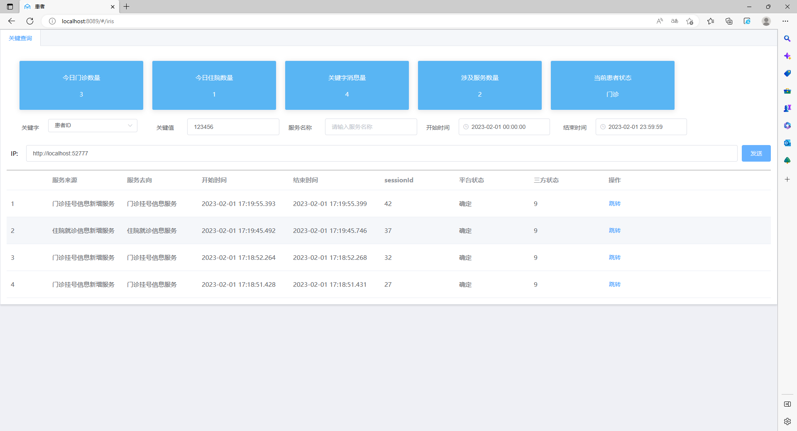
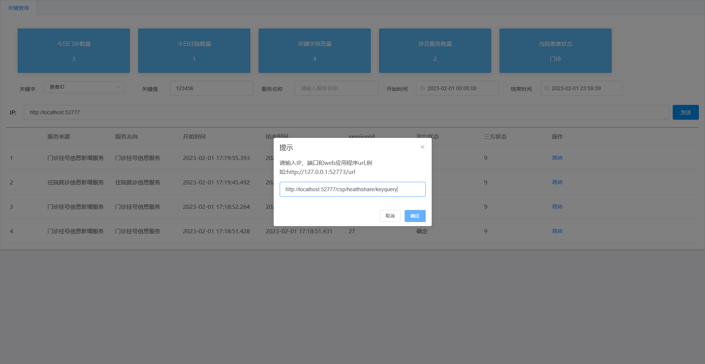
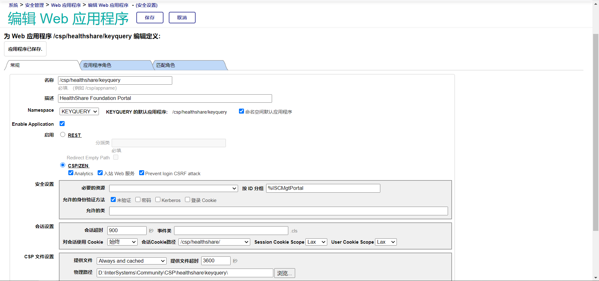
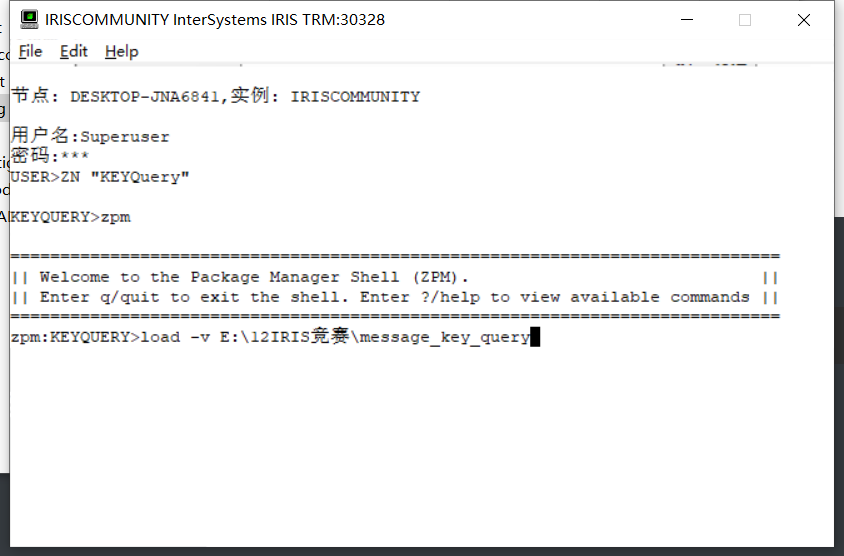
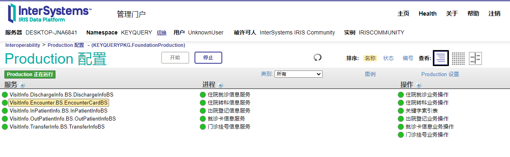
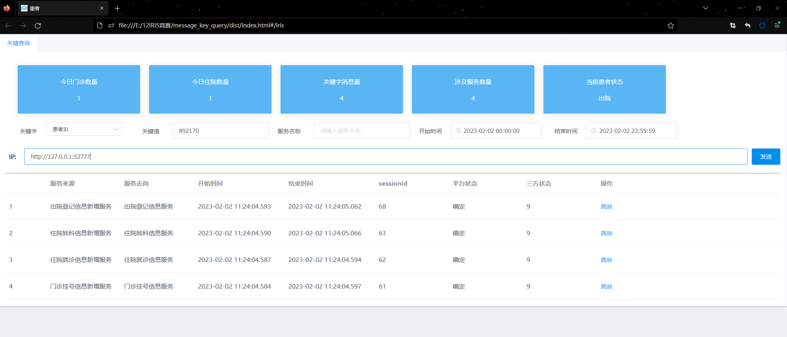

# message_key_query
---

🏆 **[InterSystems 开发者工具竞赛](https://openexchange.intersystems.com/contest/30)**🏆

  Message key query warehouse: integrate hospital information services based on Intersystems IRIS platform, and quickly locate the business situation of related patients in a hospital from the perspective of interactive services.

## abstract

  With the prevalence of COVID-19, hospitals often need to carry out flow adjustment operations on patient information, such as entering the patient ID to find the outpatient or inpatient department and time of registration. Traditional queries in the database need professional programmers to handle, but using this scheme can quickly locate the registration and visit related information and time of patients in the hospital directly from the perspective of the interface.

keyword：IRIS、REST API、ObjectScript、Globals 、SQL、DATA LOOKUP TABLES、JDBC、BPL、Model

## Presentation effect

We know that the instantiation object of the production entering IRIS will exist in the form of xml, and xPath can directly get the value we need from the angle of string. If we save the xPath path of each keyword of each service separately, and store [Keyword: Key Value: Service Name: Time: sessionID] separately through xPath when the message is sent, When we need to query the services or messages experienced by a patient through the key fields, we can directly get the list display. As shown in the figure:



The loaded list can also be clicked to jump to the specified visualization path:




Programming idea of code：https://cn.community.intersystems.com/node/525986

## Technical details

1、SQL access: IRIS supports organizing sql to retrieve data through cos language

https://docs.intersystems.com/healthconnect20223/csp/documatic/%25CSP.Documatic.cls?LIBRARY=%25SYS&PRIVATE=1&CLASSNAME=%25CSP.REST

2、Global：Persistent multidimensional array, such as lookuptable

https://docs.intersystems.com/irislatest/csp/docbook/DocBook.UI.Page.cls?KEY=GGBL_MANAGING

3、Rest API：IRIS supports encapsulation of restful interfaces for calling elsewhere

https://docs.intersystems.com/healthconnect20223/csp/documatic/%25CSP.Documatic.cls?LIBRARY=%25SYS&PRIVATE=1&CLASSNAME=%25CSP.REST

## Installation and use

### Basic environment

```
 windows 10
 IRISHealth_Community-2022.1.2.574.0-win_x64
 jdk1.8.0_191
 ZPM 0.2.1
```

### first

Install IRISHealth and JDK in Windows, add the KEYQUERY namespace in the instance, and start REST for the new web application of/keyquery/api: [/keyquery/api] The authentication method is not verified, and the role is% ALL, as shown in the figure:



### Download source code to local

```
git clone https://github.com/ddmer547/message_key_query.git
```

Open Terminal to enter the specified namespace, and use the zpm installation code, as shown in the figure:



Wait for success and start production, as shown in the figure:



Add test data

```
d ##class(KEYQUERY.SOA.LogQuery.testdata).testAdd()
```

You can also use soapui simulation to send data. The relevant template is displayed in  ./soapui

Publish the content in dist to the nodejs server or open it with a browser that does not check across domains./dist/index.html.
Front end demo address：https://ddmer547.github.io/message_key_query/#/iris
Enter the IP port of your server in IP: mine is http://127.0.0.1:52777 If the built-in test data is used, directly click Send to get the result: as shown in the figure:



# Summary

This application uses keywords as the entry point to query the whole process business data of a patient or a visit, which is convenient for the information department to query the patient's activity track, and also convenient for the operation and maintenance personnel to quickly locate the error.

